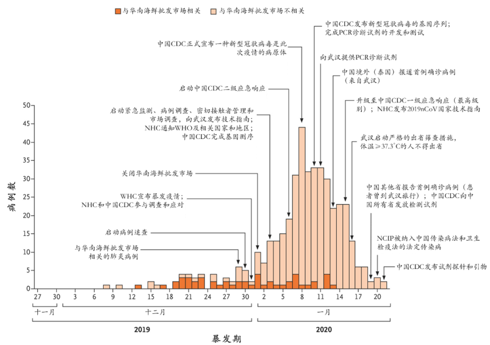

从学校一月十九日回到家里已经过去了三个多星期。在家里的生活更多的是上网关注疫情的发展动态，偶尔会听到窗外传来防疫通知，呼吁大家不要出门，实际情况是街上几乎没有人走动，与往常过年的热闹截然相反。现在乡村的街道安静得像处子，阳光透过窗户撒落在地板上，墙壁上，我想是时候记录一下最近的所见所闻了。

一月二十日，疫情汹涌而来，在这一天，我刚从南京开过来的火车下车，而我的火车就经过疫情爆发的省份‘’湖北省“，我是应该庆幸我这班列车没有在湖北省停留，还是应该愤怒于没有将消息早点公开去避免接触危险的可能。一月二十日当天下午，我从城市返回乡下，我所乘坐的交通工具都是公共交通工具。截止当时，官方宣传称：没有发现人传人的证据。但通过后来的事实表明，政府至少是延迟公布了人传人这一重要消息，当然这是后话。这一天晚上，向公众发布的最重要消息是“确认新型冠状病毒人传人”。

时间回到十二月末，在湖北，在武汉，有八位医生，他们在微信等社交平台上发布了武汉存在不明肺炎的病例，并附上了sars病毒检验的报告。随即，当局，警察便对他们进行警告，并且让他们在训诫书上签字，保证不再发表类似言论。新闻媒体，包括央视也对这件事情大肆报道，岂不知从这里便早早埋下祸根。当局对这件事情‘辟谣’，他们并不是基于事实真相，也没有丝毫科学依据，他们的依据是上层的指示，他们运用的是手中的权力，正是这权力，无情的剥夺了公众的权利：知情的权利，自由的权利，生命的权力。作为普通的个人，不说谎话，我想这八位医生已经做到了最好。

一月二十三日，湖北武汉封城。几乎没有消息从那个死一般寂静城市传出来，我在网上了解到的讯息，国内媒体只是发布了几个确诊，疑似，死亡的数字。此时，病毒早已经随着人流在武汉，湖北，全国扩散。在电视上充斥的声音满是：可防可控。同时武汉政府宣布紧急建造火神山传染病医院，病床大概1000个。

接下来几天，我所了解的是感染数字慢慢增长。官方宣称病毒潜伏期为14天。海外全是对疫情数字质疑的声音。

一月二十九日，发表于柳叶刀杂志的论文：新型冠状病毒感染的肺炎在中国武汉的初期传播动力学，表明，早在十二月就出现了人传人的现象。面对大众的质疑，为何在1月20日才公布人传人的消息，官方解释：这是一次回顾性分析，数据截止时间为1月23日。

从图中可以清晰的看出1月2日便出现了大量与海鲜市场无关的感染患者，就算确诊的时间再慢，在1月10号之前便可以得出人传人的结论。

一月三十日，世界卫生组织WHO宣布武汉肺炎为国际关注的突发公共卫生事件。

二月一日，8位被训诫医生之一的李文良医生确诊感染新型冠状病毒。

二月六日，晚上9.30，李文亮医生心脏停止跳动，医院一直进行抢救，二月七日凌晨两点过宣布死亡。

接下来武汉确诊人数持续上涨，距离武汉封城早已过去了两个星期的潜伏期。

到二月十三日，确诊方式由核糖检测改为临床诊断，确诊人数激增1万多人。
